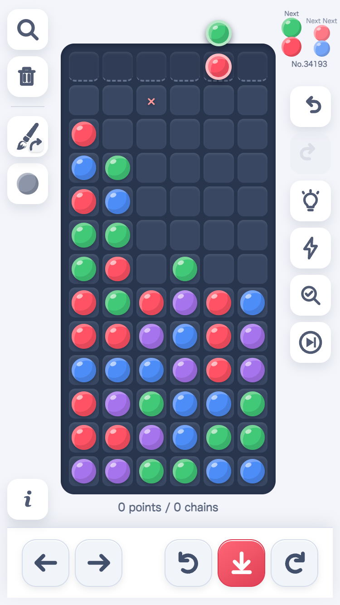
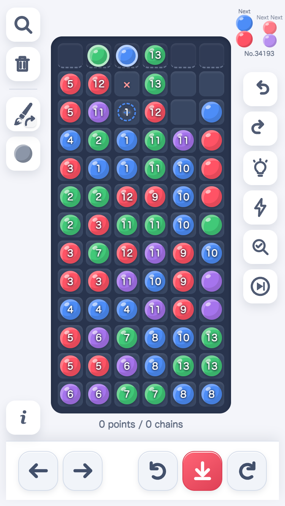
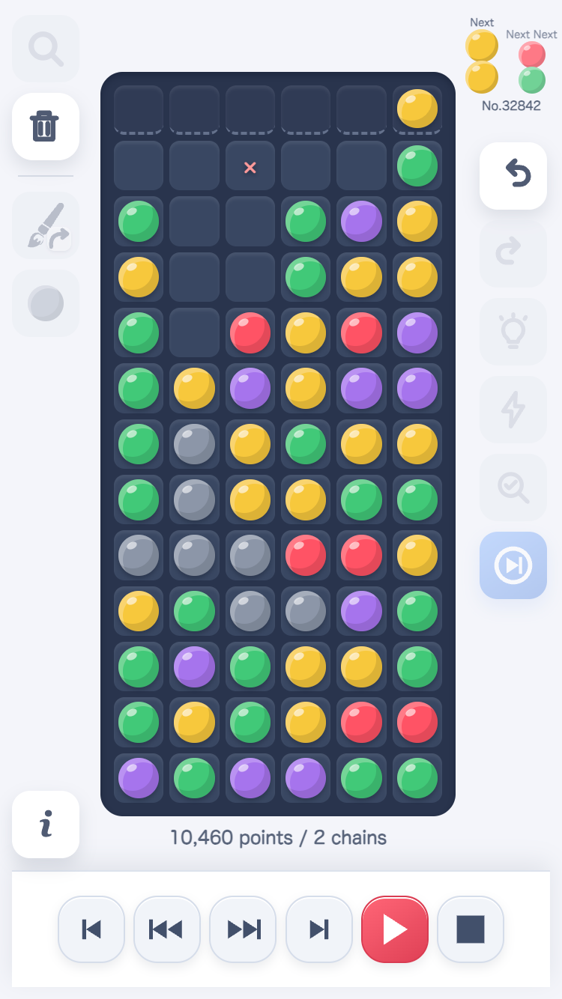
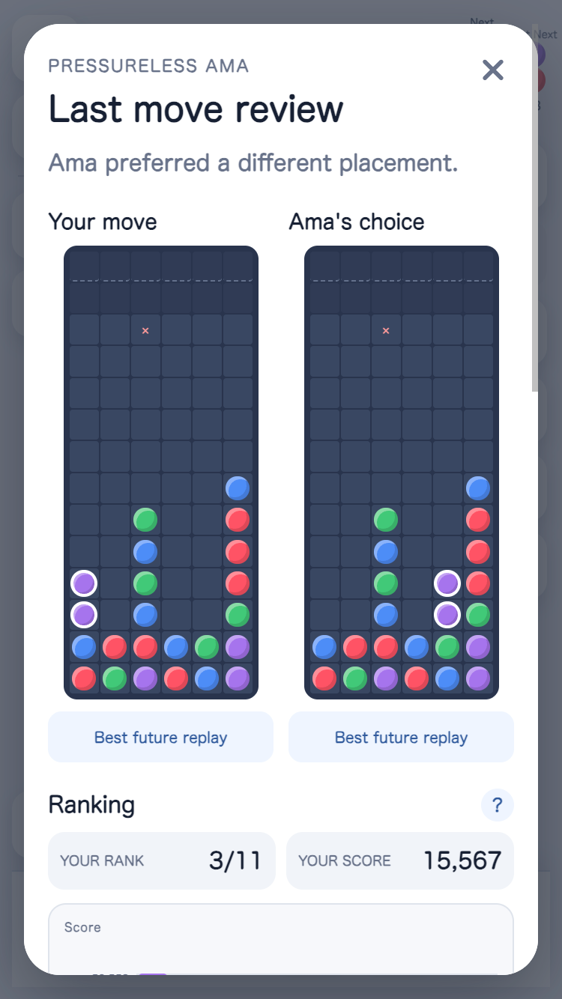
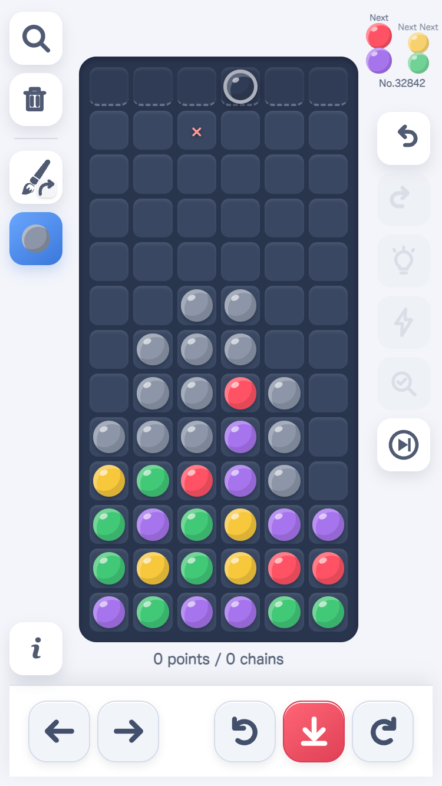
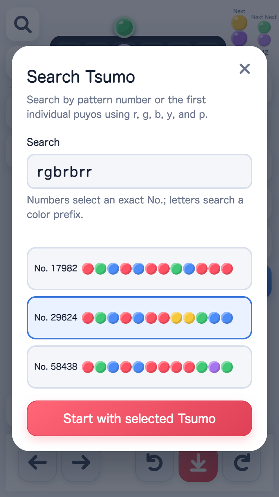
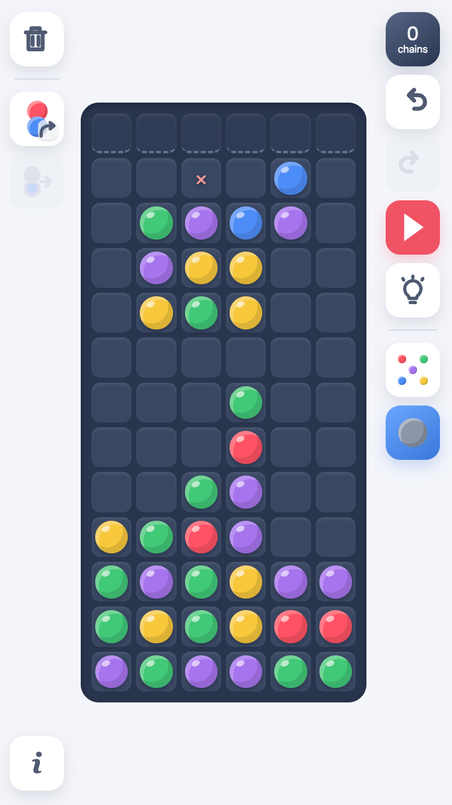
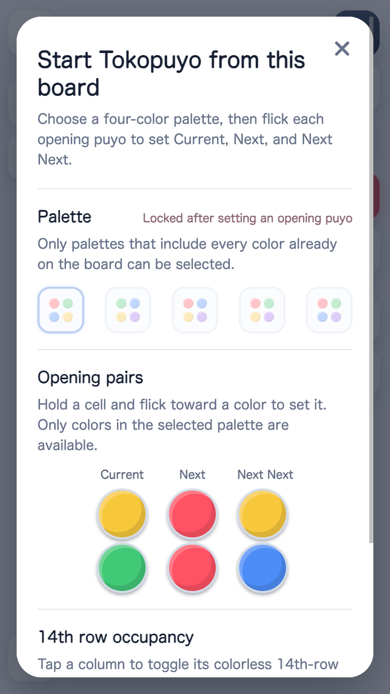

# Puyo Chain Simulator

> Draw a board, test the chain, and build longer chains with Ama.

A touch-friendly, dependency-free Puyo Puyo board lab for experimenting with chain ideas on a phone or desktop. The app opens in Tokopuyo mode for step-driven practice; Drawing mode is the board-building submode for freely placing puyos, simulating chains, and exploring ideas before returning to the retained Tokopuyo session.

<p align="center">
  <a href="https://yushiomote.github.io/puyo-draw/">Try Puyo Chain Simulator</a>
</p>

<p align="center">
  
</p>

<p align="center"><sub>Tokopuyo mode is the main experience: play a pattern with Current, Next, and Next Next always in view.</sub></p>

## Explore the features

<table>
  <thead>
    <tr>
      <th align="left">What you can do</th>
      <th align="center">See it in action</th>
    </tr>
  </thead>
  <tbody>
    <tr>
      <td>
        <strong>Get long-chain construction suggestions</strong><br />
        Ask Ama to search the current field for promising placements. Numbered candidates make the potential of each route easy to compare at a glance.
      </td>
      <td align="center">
        
      </td>
    </tr>
    <tr>
      <td>
        <strong>Inspect chains step by step</strong><br />
        Turn on chain step mode to pause the result and move through each round with first, previous, next, last, play, and stop controls.
      </td>
      <td align="center">
        
      </td>
    </tr>
    <tr>
      <td>
        <strong>Review your last move with Ama</strong><br />
        Compare your placement with Ama's preferred choice, then inspect the ranking and score to understand why another route was stronger. Learn more from the <a href="https://github.com/citrus610/ama">official Ama AI project</a>.
      </td>
      <td align="center">
        
      </td>
    </tr>
    <tr>
      <td>
        <strong>Drop garbage puyos</strong><br />
        Enable Tokopuyo garbage mode to replace the active pair with a movable garbage puyo. Use it to practice handling pressure and see how garbage interacts with clearing groups.
      </td>
      <td align="center">
        
      </td>
    </tr>
    <tr>
      <td>
        <strong>Search and start a specific Tsumo</strong><br />
        Find a pattern by its number or by entering the first puyo colors, compare matching sequences, and start Tokopuyo with the selected Tsumo.
      </td>
      <td align="center">
        
      </td>
    </tr>
    <tr>
      <td>
        <strong>Build and test a board in Drawing mode</strong><br />
        Move from Tokopuyo into the Drawing submode to place colored or garbage puyos, erase cells, and simulate the settled field. When the board is ready, choose the opening pairs and start Tokopuyo directly from your drawing.
      </td>
      <td align="center">
        
        <br />
        
      </td>
    </tr>
  </tbody>
</table>

Ama's output is a bounded search and heuristic signal for exploring ideas—not a guarantee of the globally optimal move.

## A quick tour

1. Open the [live demo](https://yushiomote.github.io/puyo-draw/). It starts in Tokopuyo mode with a random pattern.
2. Practice with Current, Next, and Next Next using the move, rotate, and drop controls.
3. Switch to Drawing mode, hold a cell, and flick toward a color to sketch a board.
4. Tap Suggestion to see possible extensions, then Simulate to watch the chain resolve.
5. Start Tokopuyo from This Board to practice the designed field, or switch back to return to the retained Tokopuyo session. Then try long-chain Suggestion, emergency-attack Suggestion, Review Last Move, and chain step mode.

## Local Development

Start the included cache-disabled development server:

```sh
npm run dev
```

Open <http://localhost:4173> on the Mac. The server listens on all network interfaces, so an iPhone on the same Wi-Fi can use the Mac's local IP address, such as `http://192.168.1.23:4173`. On macOS, find the Wi-Fi address with `ipconfig getifaddr en0`.

If the iPhone cannot connect, allow incoming connections for the terminal or Node.js in macOS Firewall settings, and make sure both devices are on the same network. The server is intended for local development and is not an internet-facing server.

The development server sends `Cache-Control: no-store`, so JavaScript module changes take effect on the same port without a hard refresh. A different port can be passed after `--`, for example `npm run dev -- 4180`.

Run the logic tests with:

```sh
npm test
```

## GitHub Pages

Pushing to the `main` branch triggers `.github/workflows/deploy.yml`. The workflow adds the deployment commit SHA to every local JavaScript and CSS URL before upload, preventing modules from different releases from being mixed by browser caches. In the repository settings, set Pages → Build and deployment → Source to **GitHub Actions**.

## Documentation

- [Product concept](docs/CONCEPT.md)
- [Product specification](docs/SPECIFICATION.md)
- [Tokopuyo specification](docs/TOCOPUYO_TSUMO_SPECIFICATION.md)
- [Tokopuyo implementation plan](docs/TOCOPUYO_IMPLEMENTATION_PLAN.md)
- [Contribution guidelines](AGENTS.md)
