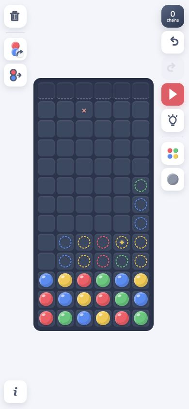
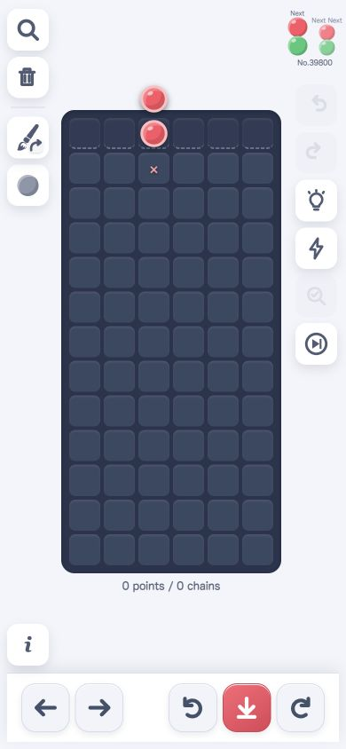
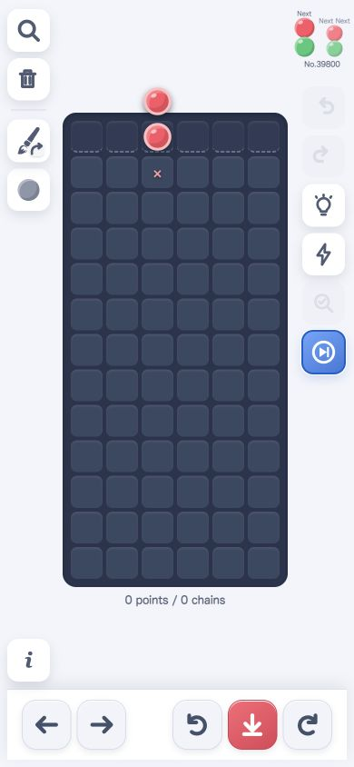
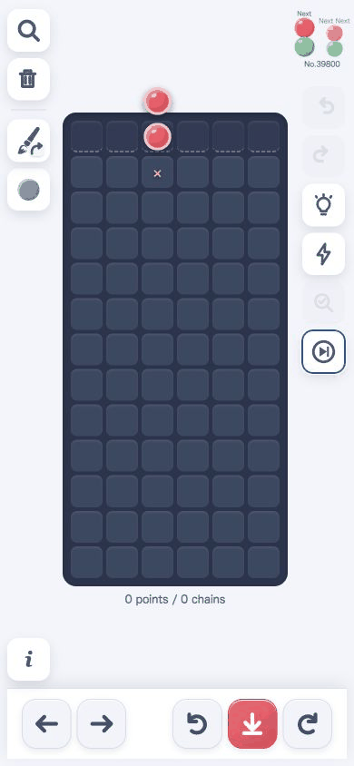

# Puyo Chain Simulator

> Draw a board, test the chain, and build longer chains with Ama.

A touch-friendly, dependency-free Puyo Puyo board lab for experimenting with chain ideas on a phone or desktop. The app opens in Tokopuyo mode for step-driven practice; Drawing mode is the board-building submode for freely placing puyos, simulating chains, and exploring ideas before returning to the retained Tokopuyo session.

<p align="center">
  <a href="https://yushiomote.github.io/puyo-draw/">Try Puyo Chain Simulator</a>
</p>

<p align="center">
  
</p>

<p align="center"><sub>Drawing mode: dotted puyos show one possible way to extend the current chain structure.</sub></p>

## What makes it useful

### Ama suggestions for the next move

- Ask for a chain-extension suggestion while designing a settled board. Candidate additions appear directly on the field as dotted puyos.
- In Tokopuyo mode, Pressureless Ama searches legal Current placements for long-chain construction and ranks several alternatives across six sampled futures.
- Review the last move side by side with Ama's analysis, including move rank, future-potential evidence, and the move's immediate board evaluation.

Ama's output is a bounded search and heuristic signal for exploring ideas—not a guarantee of the globally optimal move.

### Draw, simulate, and iterate

- Use the mobile-friendly Drawing mode to hold a cell and flick toward a color, garbage puyo, or delete.
- Cycle through four-color palettes or enable five-color drawing when experimenting freely.
- Press Simulate to resolve gravity, clearing, garbage interactions, and every subsequent chain.
- Undo and redo board changes together with the displayed score and chain count.

### Start Tokopuyo from your own setup

Turn a carefully designed Drawing-mode board into a step-driven Tokopuyo practice session. Choose a compatible color palette, set the opening Current / Next / Next Next pairs, and optionally configure the special fourteenth-row occupancy.

<p align="center">
  
</p>

<p align="center"><sub>Tokopuyo mode: move, rotate, and drop a pair while the next two pairs stay visible.</sub></p>

### See every part of a chain

Enable chain step mode before dropping a pair that fires. The bottom bar becomes a chain timeline: jump to the first or last round, move one round at a time, or play and pause the sequence. This makes it easy to inspect exactly where a connection forms and how gravity creates the next chain.

<p align="center">
  
</p>

### Add pressure with garbage puyos

Garbage puyos can be placed from the Drawing-mode flick menu. Tokopuyo also has a separate garbage mode that replaces the active Current with one movable garbage puyo without consuming the normal queue. Garbage does not form groups by itself, but clears when it touches a clearing color group.

## A quick tour

1. Open the [live demo](https://yushiomote.github.io/puyo-draw/). It starts in Tokopuyo mode with a random pattern.
2. Practice with Current, Next, and Next Next using the move, rotate, and drop controls.
3. Switch to Drawing mode, hold a cell, and flick toward a color to sketch a board.
4. Tap Suggestion to see possible extensions, then Simulate to watch the chain resolve.
5. Start Tokopuyo from This Board to practice the designed field, or switch back to return to the retained Tokopuyo session. Then try long-chain Suggestion, emergency-attack Suggestion, Review Last Move, and chain step mode.

<p align="center">
  
</p>

<p align="center"><sub>Tokopuyo in action: move the pair, rotate it, and drop it into the field.</sub></p>

## Live Demo

Open the deployed app on GitHub Pages: [Puyo Chain Simulator](https://yushiomote.github.io/puyo-draw/)

## Local Development

Start the included cache-disabled development server:

```sh
npm run dev
```

Open <http://localhost:4173> on the Mac. The server listens on all network interfaces, so an iPhone on the same Wi-Fi can use the Mac's local IP address, such as `http://192.168.1.23:4173`. On macOS, find the Wi-Fi address with `ipconfig getifaddr en0`.

If the iPhone cannot connect, allow incoming connections for the terminal or Node.js in macOS Firewall settings, and make sure both devices are on the same network. The server is intended for local development and is not an internet-facing server.

The development server sends `Cache-Control: no-store`, so JavaScript module changes take effect on the same port without a hard refresh. A different port can be passed after `--`, for example `npm run dev -- 4180`.

Run the logic tests with:

```sh
npm test
```

## GitHub Pages

Pushing to the `main` branch triggers `.github/workflows/deploy.yml`. The workflow adds the deployment commit SHA to every local JavaScript and CSS URL before upload, preventing modules from different releases from being mixed by browser caches. In the repository settings, set Pages → Build and deployment → Source to **GitHub Actions**.

## Documentation

- [Product concept](docs/CONCEPT.md)
- [Product specification](docs/SPECIFICATION.md)
- [Tokopuyo specification](docs/TOCOPUYO_TSUMO_SPECIFICATION.md)
- [Tokopuyo implementation plan](docs/TOCOPUYO_IMPLEMENTATION_PLAN.md)
- [Contribution guidelines](AGENTS.md)
